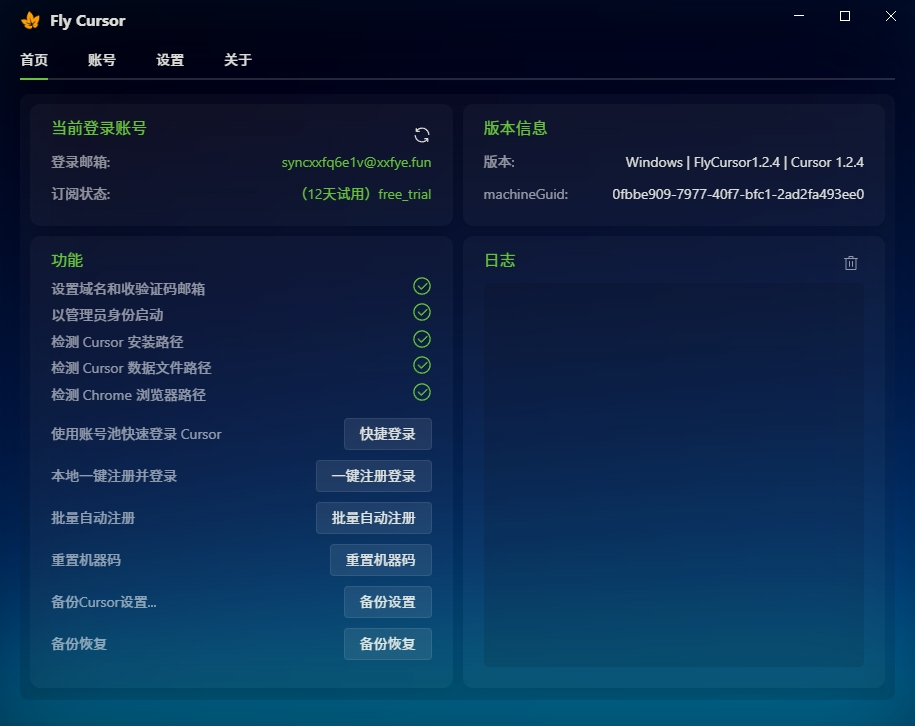
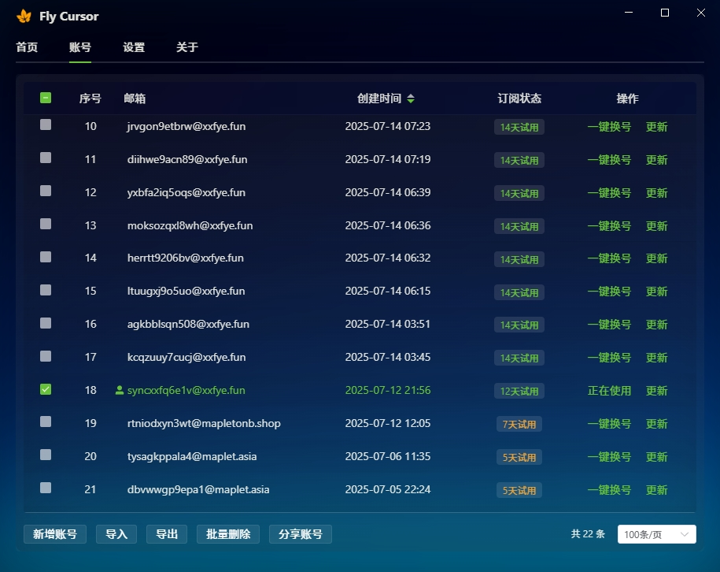
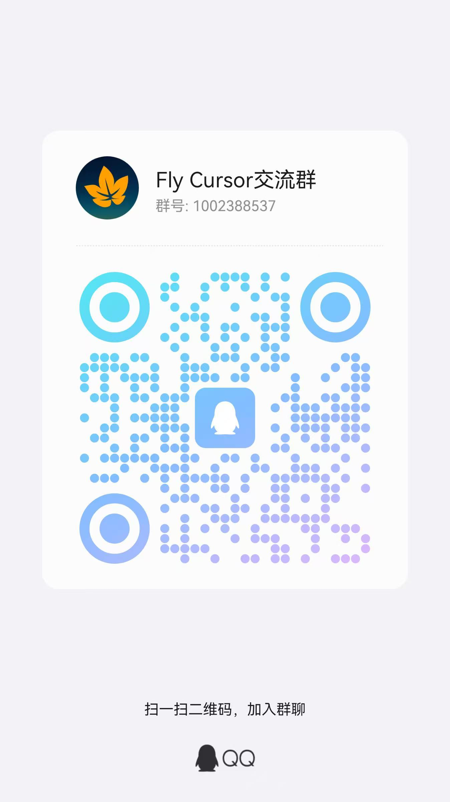

# FlyCursor · Effortlessly Extend Your Cursor Pro Trial to 14 Days

# [Supports Claude 4, GPT 5] [Free to Use]

> 🚀 **FlyCursor** ensures your Cursor Pro trial never expires, with batch local account registration + shared account pool, instant account switching, and unlimited access to advanced models.
>
> - Models like `Claude 4`, `Gemini 2.5 Pro`, and `GPT 5` require a proxy to use.
> - Cursor requires new accounts to bind a virtual payment card to activate the trial. It's recommended to cancel the subscription immediately after activation, otherwise charges will apply when the trial expires.
> - Supports Windows and macOS, with no restrictions on Cursor versions and supports upgrades. (Currently compatible with Cursor v1.3.9)
> - QQ Group: [1002388537](https://qun.qq.com/universal-share/share?ac=1&authKey=ZpKpMm4QdN1I2eWzqZYinybEpN1PfyrUlmgA01ZG0mAVSUVg0fWQWngzBnl7jG79&busi_data=eyJncm91cENvZGUiOiIxMDAyMzg4NTM3IiwidG9rZW4iOiJNR0hENmlHS0xHSzdmMm0xRmZSNjJpczdJMWl5WkhrNWI0SHVQOUZhemNuSTcvN0VQNUNSZVZ4Ty9kbU1KSFBWIiwidWluIjoiMzY2Mzg1NjQyOSJ9&data=ghmRHANkTOdaEFfbxNKWtfgZ5emKN2-RQ-FKgFvWnukdfbup51jtrgQKlbPS_2O-0QHYmuRUd7her7DzYjH43A&svctype=4&tempid=h5_group_info)
> - Documentation: [Detailed Guide & FAQ](https://docs.qq.com/aio/DUGd6V2t5WUVoQUdG)
> - Download Links: [GitHub](https://github.com/liqiang-xxfy/fly-cursor-free/releases/latest) | [123 Cloud Drive](https://www.123865.com/s/uY80Td-AtUh) | [Baidu Netdisk](https://pan.baidu.com/s/1UPg4D4VO_F_47Fl1A7oc8g?pwd=9gmc)
> - If startup fails, try disabling GPU acceleration by adding startup parameters: "--disable-gpu --no-sandbox"

#### ⚠️ Cursor has discontinued Alipay for trial activation. Virtual cards are now required for unlimited trial extensions.
#### ⚠️ One virtual credit card can activate trials for up to 5 Cursor accounts.

## Core Features
- **One-Click Account Switching**: Free account pool with instant switching, maintaining stable 14-day Cursor Pro trials
- **Local Auto Registration**: Automatically registers new Cursor accounts and passes CAPTCHA verification. Manual payment card binding required (please **cancel subscription immediately** after binding to avoid automatic charges when trial expires)

---

## Screenshots

> - Resolves: "Please upgrade to Pro to continue."
> - Resolves: "Free users can only use GPT 4.1 or Auto as premium models"
> - Resolves: "Model not available. This model provider doesn't serve your region."

---

## Prerequisites

#### 1. Email for Receiving Cursor Verification Codes

- Choose between [TempMail Temporary Email](https://tempmail.plus) or [QQ Email](https://wx.mail.qq.com/)

#### 2. Virtual Payment Card

#### 3. Personal Domain

- A domain is required to generate unlimited email addresses for registration.
  It's recommended to purchase your own domain. [Alibaba Cloud offers domains for around 3 RMB/year](https://wanwang.aliyun.com/domain?spm=5176.30275541.J_ZGek9Blx07Hclc3Ddt9dg.2.6d242f3dOjUe0y&scm=20140722.S_card@@%E4%BA%A7%E5%93%81@@3417315._.ID_card@@%E4%BA%A7%E5%93%81@@3417315-RL_%E5%9F%9F%E5%90%8D-LOC_2024SPSearchCard-OR_ser-PAR1_213e367317506646568403729e0b4e-V_4-RE_new5-P0_0-P1_0)

---

## Configuration Tutorial: [Auto Registration and Trial Extension Guide](https://docs.qq.com/aio/DUGd6V2t5WUVoQUdG?p=Zbo4uw0V0wGxKiybuT7EEX)

---

## 💰 Donations

If you find this project helpful, please consider donating to encourage continued updates.

  <table>
    <tr>
      <td>
         
      </td>
      <td>
         
      </td>
      <td>
         
      </td>
    </tr>
  </table>

---

## License Agreement

To prevent abuse, the code is not fully open source.

---

## 📩 Disclaimer

This tool is for learning and research purposes only. Any consequences arising from the use of this tool are the sole responsibility of the user.

---